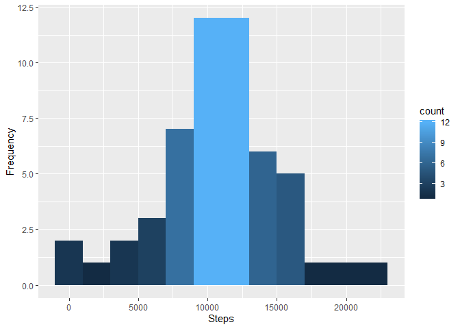
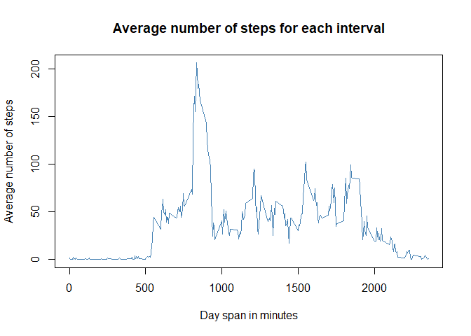
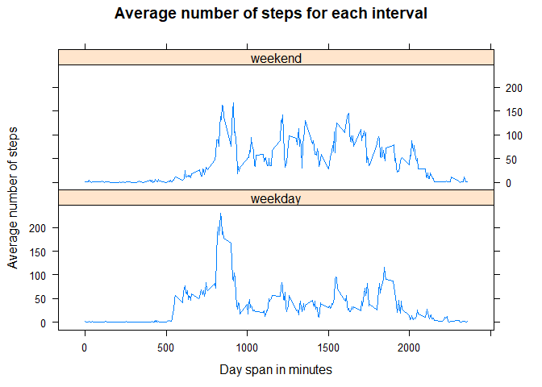

## Loading and preprocessing the data
Loading the required library:

```r
library(lubridate)
library(tidyr)
library(ggplot2)
library(lattice)
library(dplyr)
```
1. Load the data (i.e. read.csv())


```r
dat <- read.csv(unz("activity.zip", "activity.csv"),  
                    colClasses = c("integer", "Date", "integer"))
```
2. Process/transform the data (if necessary) into a format suitable for your analysis  

No processing needed.

## What is mean total number of steps taken per day?
For this part of the assignment, you can ignore the missing values in the dataset.

1. Calculate the total number of steps taken per day

```r
report <- dat %>% drop_na() %>% group_by(date) %>% summarize(total=sum(steps))
```
2. Make a histogram of the total number of steps taken each day

```r
p <- qplot(report$total, fill=..count.., 
           geom="histogram", binwidth = 2000)
p <- p + labs(x="Steps", y="Frequency")
print(p)
```

<!-- -->

3. Calculate and report the mean and median of the total number of steps taken per day  

Mean:

```r
mean(report$total)
```

```
## [1] 10766.19
```

Median:

```r
median(report$total)
```

```
## [1] 10765
```

## What is the average daily activity pattern?
1. Make a time series plot (i.e. type = "l") of the 5-minute interval (x-axis) and the average number of steps taken, averaged across all days (y-axis)

```r
intMean <- dat %>% drop_na() %>% group_by(interval) %>% summarize(mean=mean(steps))
plot(intMean$interval, intMean$mean, type = "l", col = "steelblue",
     main = "Average number of steps for each interval",
     xlab = "Day span in minutes", ylab = "Average number of steps")
```

<!-- -->

2. Which 5-minute interval, on average across all the days in the dataset, contains the maximum number of steps?

```r
intMean$interval[which.max(intMean$mean)]
```

```
## [1] 835
```

## Imputing missing values
1. Calculate and report the total number of missing values in the dataset (i.e. the total number of rows with NAs)

```r
sum(is.na(dat$steps))
```

```
## [1] 2304
```
2. Devise a strategy for filling in all of the missing values in the dataset. The strategy does not need to be sophisticated. For example, you could use the mean/median for that day, or the mean for that 5-minute interval, etc.

3. Create a new dataset that is equal to the original dataset but with the missing data filled in.

```r
impDat <- dat
for (i in 1:nrow(impDat)) {
  if(is.na(impDat$steps[i])) {
    repValue <- intMean[intMean$interval == impDat$interval[i],]
    impDat$steps[i] <- repValue$mean
  }
}
```

4. Make a histogram of the total number of steps taken each day and Calculate and report the mean and median total number of steps taken per day.

```r
impReport <- impDat %>% group_by(date) %>% summarize(total=sum(steps))
p1 <- qplot(report$total, fill=..count.., geom="histogram", binwidth = 2000)
p1 <- p1 + labs(x="Steps", y="Frequency")
print(p1)
```

<!-- -->

Mean:

```r
mean(impReport$total)
```

```
## [1] 10766.19
```

Median:

```r
median(impReport$total)
```

```
## [1] 10766.19
```

Do these values differ from the estimates from the first part of the assignment?

Only the median varies and only by 1.19.

What is the impact of imputing missing data on the estimates of the total daily number of steps?

It has a very small impact.

## Are there differences in activity patterns between weekdays and weekends?
1. Create a new factor variable in the dataset with two levels – “weekday” and “weekend” indicating whether a given date is a weekday or weekend day.

```r
for (i in 1:nrow(impDat)) {
  d <- weekdays(impDat$date[i],abbreviate = TRUE)
  if (d == "Sat" | d == "Sun"){d <- "weekend"}
    else {d <- "weekday"}
  impDat$weekday[i] <- d
}
impDat$weekday <- as.factor(impDat$weekday)
```

2. Make a panel plot containing a time series plot (i.e. type = "l") of the 5-minute interval (x-axis) and the average number of steps taken, averaged across all weekday days or weekend days (y-axis). See the README file in the GitHub repository to see an example of what this plot should look like using simulated data.

```r
weekdayMean <- impDat %>% group_by(interval, weekday) %>% summarize(mean=mean(steps))
lat <- xyplot(mean ~ interval | weekday, data = weekdayMean,
              type = "l", layout = c(1, 2), 
              xlab = "Day span in minutes", 
              ylab = "Average number of steps",
              main = "Average number of steps for each interval")
print(lat)
```

<!-- -->

